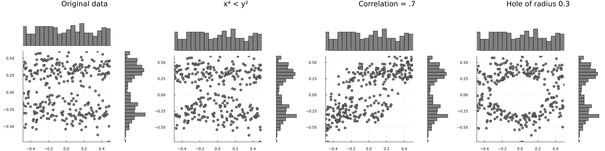

# Permute flip
Julia algorithm for permuting data towards a certain multivariate structure defined by any function. See [the pdf](./flip_algorithm.pdf) for a very incomplete start of a description of this algorithm.

